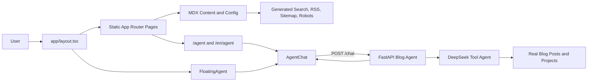

# JaoHun Blog Frontend

Static Next.js frontend for JaoHun Blog. It uses App Router, static export, MDX content files, build-time content validation, Shiki code highlighting, local search assets, RSS, Sitemap, and robots.txt generation.

Chinese is the default language. English pages are generated under `/en` with explicit static routes so `output: 'export'` remains supported.

## Features

- Static blog pages for posts, categories, tags, projects, moments, tech notes, and about pages
- Bilingual routes with Chinese as the default language and English under `/en`
- MDX content pipeline with schema validation and draft filtering
- Local search index generation for Chinese and English content
- RSS, Sitemap, and robots.txt generation before production build
- Full-page Blog Agent at `/agent` and `/en/agent`
- Global floating Agent window on normal blog pages

## Architecture



## Blog Agent Integration

The chat UI is shared by the full-page route and the floating window:

```text
components/agent/AgentChat.tsx
├─ app/agent/page.tsx
├─ app/en/agent/page.tsx
└─ components/agent/FloatingAgent.tsx
```

`FloatingAgent` is mounted in `app/layout.tsx`, uses `position: fixed`, and hides itself on `/agent` and `/en/agent` to avoid rendering two chats at once.

The frontend calls the backend at:

```text
POST http://127.0.0.1:8000/chat
```

Set `NEXT_PUBLIC_AGENT_API_URL` to use another backend URL:

```powershell
$env:NEXT_PUBLIC_AGENT_API_URL="http://127.0.0.1:8000"
```

## Development

Install dependencies:

```powershell
corepack pnpm install
```

Run the frontend:

```powershell
corepack pnpm dev
```

Open:

```text
http://localhost:3000
```

For Agent chat, also run the companion FastAPI backend:

```powershell
$env:BLOG_ROOT="<path-to-blog-repository>"
uvicorn app.main:app --reload --host 127.0.0.1 --port 8000
```

## Verification

```powershell
corepack pnpm content:check
corepack pnpm test
corepack pnpm lint
corepack pnpm build
corepack pnpm launch:check
```

The static output is generated in `out`.

## Static Preview

```powershell
corepack pnpm preview
```

Open:

```text
http://localhost:4173
```

## Content

Posts live in `content/posts`. Keep drafts with `draft: true`; production builds automatically filter them out.

Site, author, navigation, footer, and project data live in `config`.

Create a Chinese draft:

```powershell
corepack pnpm new-post "文章标题"
```

Create an English draft with a custom slug:

```powershell
corepack pnpm new-post "Post Title" post-title en
```

## Repository Map

```text
app/                  App Router pages, root layout, localized pages
components/agent/     Shared Agent chat UI and floating launcher
components/common/    Shared UI utilities
components/layout/    Header and footer
components/post/      Post rendering components
components/search/    Client-side local search
components/sidebar/   Page sidebars and table of contents
config/               Site, author, nav, footer, and project config
content/posts/        MDX posts and drafts
lib/content/          Content parsing, validation, RSS, sitemap, search
scripts/              Build-time content and launch checks
tests/                Vitest content and UI tests
```
